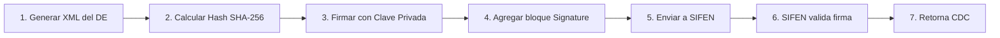

Análisis: Estructura de Datos para Empresa/Sede/Consultorio
🔍 Situación Actual
Actualmente tienes:

Tabla consultorio: Registra los consultorios dentro de la empresa
❓ Problema Identificado
Si la empresa tiene múltiples sucursales o sedes, la estructura actual podría ser insuficiente para:

Diferenciar consultorios entre diferentes sedes
Gestionar información administrativa por sede
Escalar el sistema para múltiples ubicaciones
✅ Recomendación: SÍ, es necesaria una tabla empresa o sede
Justificación
Escalabilidad: Si existe la posibilidad de múltiples sucursales, es mejor diseñar desde el inicio
Separación de responsabilidades: Información de la sede vs información del consultorio
Flexibilidad administrativa: Diferentes configuraciones por sede
Reportería: Análisis por sede/sucursal
📊 Estructura Propuesta
Opción 1: Jerarquía Simple (Recomendada para iniciar)
EMPRESA (matriz/holding)
    └── SEDE/SUCURSAL
            └── CONSULTORIO
Tabla: empresa
sql
CREATE TABLE empresa (
    id_empresa INT PRIMARY KEY AUTO_INCREMENT,
    nombre_comercial VARCHAR(255) NOT NULL,
    razon_social VARCHAR(255) NOT NULL,
    ruc VARCHAR(20) UNIQUE,
    telefono_principal VARCHAR(20),
    email_contacto VARCHAR(100),
    logo VARCHAR(255),
    fecha_creacion TIMESTAMP DEFAULT CURRENT_TIMESTAMP,
    estado ENUM('activa', 'inactiva') DEFAULT 'activa'
);
Tabla: sede (o sucursal)
sql
CREATE TABLE sede (
    id_sede INT PRIMARY KEY AUTO_INCREMENT,
    id_empresa INT NOT NULL,
    nombre_sede VARCHAR(255) NOT NULL,
    codigo_sede VARCHAR(20) UNIQUE,
    direccion TEXT,
    ciudad VARCHAR(100),
    departamento VARCHAR(100),
    telefono VARCHAR(20),
    email VARCHAR(100),
    horario_atencion TEXT,
    es_principal BOOLEAN DEFAULT FALSE,
    latitud DECIMAL(10, 8),
    longitud DECIMAL(11, 8),
    fecha_apertura DATE,
    estado ENUM('activa', 'inactiva', 'mantenimiento') DEFAULT 'activa',
    FOREIGN KEY (id_empresa) REFERENCES empresa(id_empresa)
);
Tabla: consultorio (modificada)
sql
CREATE TABLE consultorio (
    id_consultorio INT PRIMARY KEY AUTO_INCREMENT,
    id_sede INT NOT NULL,
    nombre_consultorio VARCHAR(100) NOT NULL,
    codigo_consultorio VARCHAR(20) UNIQUE,
    numero_consultorio VARCHAR(10),
    piso VARCHAR(10),
    tipo_consultorio ENUM('general', 'especializado', 'urgencias', 'cirugia'),
    capacidad_personas INT DEFAULT 2,
    tiene_equipamiento BOOLEAN DEFAULT FALSE,
    descripcion_equipamiento TEXT,
    estado ENUM('disponible', 'ocupado', 'mantenimiento', 'inactivo') DEFAULT 'disponible',
    FOREIGN KEY (id_sede) REFERENCES sede(id_sede)
);
🎯 Ventajas de esta Estructura
1. Datos Administrativos Centralizados por Sede
Dirección completa
Datos de contacto específicos
Horarios de atención diferenciados
Geolocalización para múltiples ubicaciones
2. Gestión Multi-sede
Reportes por sede
Configuraciones independientes
Identificación clara de sede principal
3. Escalabilidad
Fácil agregar nuevas sedes
No requiere modificar estructura al crecer
Soporte para expansión futura
4. Integridad Referencial
Relaciones claras entre entidades
Eliminación/desactivación en cascada controlada
📋 Datos Administrativos Importantes
Por Empresa:
✅ Razón social y nombre comercial
✅ RUC/NIT
✅ Logo corporativo
✅ Datos fiscales generales
Por Sede:
✅ Dirección física completa
✅ Teléfonos y emails de contacto
✅ Horarios de atención
✅ Coordenadas GPS (para mapas/apps)
✅ Código identificador único
✅ Indicador de sede principal
Por Consultorio:
✅ Número/código de consultorio
✅ Ubicación dentro de la sede (piso)
✅ Tipo y especialización
✅ Equipamiento disponible
🚀 Casos de Uso que Resuelve
Aplicación con múltiples sedes
sql
   -- Listar consultorios de una sede específica
   SELECT c.* 
   FROM consultorio c
   JOIN sede s ON c.id_sede = s.id_sede
   WHERE s.codigo_sede = 'SEDE-ASUNCION-01';
Dashboard administrativo
sql
   -- Estadísticas por sede
   SELECT s.nombre_sede, COUNT(c.id_consultorio) as total_consultorios
   FROM sede s
   LEFT JOIN consultorio c ON s.id_sede = c.id_sede
   WHERE s.estado = 'activa'
   GROUP BY s.id_sede;
Selector de sede en la aplicación
sql
   -- Obtener sedes activas con su información
   SELECT * FROM sede 
   WHERE estado = 'activa' 
   ORDER BY es_principal DESC, nombre_sede;
⚠️ ¿Cuándo NO es necesario?
Si la empresa NUNCA tendrá más de una ubicación física
Si es un proyecto muy pequeño de uso interno único
Si el presupuesto/tiempo no permite sobre-diseñar
Nota: Incluso en estos casos, es mejor diseñar con escalabilidad desde el inicio

🎬 Plan de Implementación
Fase 1: Creación de Tablas
Crear tabla empresa
Crear tabla sede
Modificar tabla consultorio (agregar id_sede)
Fase 2: Migración de Datos
sql
-- 1. Insertar empresa principal
INSERT INTO empresa (nombre_comercial, razon_social, ruc) 
VALUES ('Clínica XYZ', 'Clínica XYZ S.A.', '80012345-6');

-- 2. Insertar sede principal
INSERT INTO sede (id_empresa, nombre_sede, codigo_sede, es_principal) 
VALUES (1, 'Sede Central', 'SEDE-001', TRUE);

-- 3. Actualizar consultorios existentes
UPDATE consultorio SET id_sede = 1;
Fase 3: Actualizar Aplicación
Modificar formularios para incluir selección de sede
Actualizar consultas SQL
Agregar filtros por sede en reportes
📝 Conclusión
SÍ, es altamente recomendable crear una estructura con tabla empresa y sede porque:

✅ Proporciona flexibilidad administrativa
✅ Permite escalabilidad sin refactorización masiva
✅ Separa correctamente las responsabilidades de datos
✅ Facilita reportes y análisis por ubicación
✅ Es una práctica estándar en sistemas empresariales

La inversión inicial en diseño se recupera ampliamente cuando la empresa crece o necesita gestionar múltiples ubicaciones.

Análisis: Datos de Empresa para Facturación Electrónica en Paraguay
🎯 Tu Consulta es CORRECTA
SÍ, la tabla empresa es FUNDAMENTAL para la facturación electrónica, ya que debe contener todos los datos del emisor que la DNIT (Dirección Nacional de Ingresos Tributarios) requiere para el Sistema SIFEN (Sistema Integrado de Facturación Electrónica Nacional).

📋 Datos OBLIGATORIOS según DNIT para Facturación Electrónica
1. Datos de Identificación Tributaria (CRÍTICOS)
sql
-- Campos OBLIGATORIOS por DNIT/SIFEN
ruc VARCHAR(20) NOT NULL UNIQUE,           -- Formato: 12345678-9 o 80012345-6
digito_verificador CHAR(1) NOT NULL,       -- El dígito después del guion
razon_social VARCHAR(255) NOT NULL,        -- Nombre legal registrado en RUC
nombre_comercial VARCHAR(255),             -- Nombre de fantasía (opcional)
tipo_contribuyente ENUM('persona_fisica', 'persona_juridica', 'eas') NOT NULL
Validación del RUC:

Personas físicas: empiezan con números normales (ej: 12345678-9)
Personas jurídicas (empresas): empiezan con 800XXXXX-V
El dígito verificador se calcula con algoritmo específico de DNIT
2. Datos de Domicilio Fiscal (OBLIGATORIOS)
sql
-- Requeridos por DNIT según Resolución General N° 79/2021
departamento VARCHAR(100) NOT NULL,        -- Ej: "Central", "Asunción"
distrito VARCHAR(100) NOT NULL,            -- Ej: "Lambaré", "San Lorenzo"
ciudad VARCHAR(100) NOT NULL,              -- Localidad específica
direccion TEXT NOT NULL,                   -- Dirección completa del domicilio fiscal
codigo_postal VARCHAR(10),
numero_casa VARCHAR(20),                   -- Número de casa/edificio
3. Datos de Contacto (OBLIGATORIOS para SIFEN)
sql
telefono VARCHAR(20) NOT NULL,             -- Teléfono principal
celular VARCHAR(20) NOT NULL,              -- Requerido para certificado digital
email VARCHAR(100) NOT NULL,               -- Email corporativo oficial
Para obtener el certificado de firma electrónica, es obligatorio tener declarado en el RUC: número de celular, correo electrónico y nombre del representante legal.

4. Datos del Representante Legal (OBLIGATORIOS)
sql
-- Para personas jurídicas
representante_legal_nombre VARCHAR(255) NOT NULL,
representante_legal_apellido VARCHAR(255) NOT NULL,
representante_legal_ci VARCHAR(20) NOT NULL,        -- Cédula de identidad
representante_legal_cargo VARCHAR(100),             -- Ej: "Presidente", "Gerente"
5. Datos para Facturación Electrónica (SIFEN)
sql
-- Certificación y habilitación
facturador_electronico BOOLEAN DEFAULT FALSE,
fecha_habilitacion_sifen DATE,
certificado_firma_digital TEXT,                     -- Path o datos del certificado
codigo_seguridad_contribuyente VARCHAR(100),        -- CSC otorgado por DNIT
timbrado_electronico VARCHAR(20),                   -- Número de timbrado DTE
📊 Estructura SQL Completa Recomendada
sql
CREATE TABLE empresa (
    -- Identificadores
    id_empresa INT PRIMARY KEY AUTO_INCREMENT,
    
    -- DATOS TRIBUTARIOS OBLIGATORIOS
    ruc VARCHAR(20) NOT NULL UNIQUE COMMENT 'Formato: 12345678-9',
    digito_verificador CHAR(1) NOT NULL,
    razon_social VARCHAR(255) NOT NULL COMMENT 'Nombre legal en RUC',
    nombre_comercial VARCHAR(255) COMMENT 'Nombre de fantasía',
    tipo_contribuyente ENUM('persona_fisica', 'persona_juridica', 'eas') NOT NULL,
    
    -- DOMICILIO FISCAL (Obligatorio por DNIT)
    departamento VARCHAR(100) NOT NULL,
    distrito VARCHAR(100) NOT NULL,
    ciudad VARCHAR(100) NOT NULL,
    direccion TEXT NOT NULL COMMENT 'Dirección completa del domicilio fiscal',
    numero_casa VARCHAR(20),
    codigo_postal VARCHAR(10),
    
    -- DATOS DE CONTACTO (Obligatorios)
    telefono VARCHAR(20) NOT NULL,
    celular VARCHAR(20) NOT NULL COMMENT 'Obligatorio para certificado digital',
    email VARCHAR(100) NOT NULL,
    sitio_web VARCHAR(255),
    
    -- REPRESENTANTE LEGAL (Obligatorio para personas jurídicas)
    representante_legal_nombre VARCHAR(255),
    representante_legal_apellido VARCHAR(255),
    representante_legal_ci VARCHAR(20),
    representante_legal_cargo VARCHAR(100),
    
    -- DATOS DE FACTURACIÓN ELECTRÓNICA (SIFEN)
    facturador_electronico BOOLEAN DEFAULT FALSE,
    fecha_habilitacion_sifen DATE,
    grupo_obligatoriedad INT COMMENT 'Grupo 1-18 según DNIT',
    certificado_firma_digital TEXT COMMENT 'Path del certificado .pfx',
    clave_pin_firma_electronica VARCHAR(255) COMMENT 'Cifrado',
    codigo_seguridad_contribuyente VARCHAR(100) COMMENT 'CSC de DNIT',
    timbrado_electronico VARCHAR(20) COMMENT 'Timbrado para DTEs',
    fecha_inicio_timbrado DATE,
    fecha_fin_timbrado DATE,
    
    -- DATOS COMPLEMENTARIOS
    actividad_economica_principal VARCHAR(255),
    logo VARCHAR(255) COMMENT 'Path o URL del logo',
    
    -- CONFIGURACIÓN SIFEN
    ambiente_sifen ENUM('prueba', 'produccion') DEFAULT 'prueba',
    usa_ekuatia BOOLEAN DEFAULT FALSE COMMENT 'Sistema gratuito DNIT',
    usa_ekuatiai BOOLEAN DEFAULT FALSE COMMENT 'Bajo volumen',
    
    -- AUDITORÍA
    fecha_creacion TIMESTAMP DEFAULT CURRENT_TIMESTAMP,
    fecha_actualizacion TIMESTAMP DEFAULT CURRENT_TIMESTAMP ON UPDATE CURRENT_TIMESTAMP,
    estado ENUM('activa', 'suspendida', 'cancelada') DEFAULT 'activa',
    
    -- Índices
    INDEX idx_ruc (ruc),
    INDEX idx_estado (estado)
);
🔍 Campos Específicos para SIFEN (Sistema de Factura Electrónica)
¿Por qué estos campos?
Campo	Justificación DNIT/SIFEN
RUC + DV	El SIFEN valida el RUC del emisor al momento de enviar documentos electrónicos
Certificado Digital	Obligatorio adquirir certificado de Prestadores autorizados que contenga el RUC
Código CSC	El código QR debe incluir el Código de Seguridad del Contribuyente (CSC) otorgado por DNIT
Timbrado Electrónico	Debe tener un timbrado para documentos electrónicos habilitado por DNIT
Domicilio Fiscal	Departamento, Municipio, Localidad, Dirección, RUC, Teléfono son obligatorios para enviar el DE
🎯 Casos de Uso en Facturación
1. Emisión de Factura Electrónica
php
// Obtener datos del emisor para XML SIFEN
$empresa = Empresa::find(1);

$xmlEmisora = [
    'RUC' => $empresa->ruc,
    'dDVEmi' => $empresa->digito_verificador,
    'dRucEm' => str_replace('-', '', $empresa->ruc),
    'dNomEmi' => $empresa->razon_social,
    'dNomFanEmi' => $empresa->nombre_comercial,
    'dDirEmi' => $empresa->direccion,
    'dNumCas' => $empresa->numero_casa,
    'cDepEmi' => $empresa->codigo_departamento,
    'dDesDepEmi' => $empresa->departamento,
    'cDisEmi' => $empresa->codigo_distrito,
    'dDesDisEmi' => $empresa->distrito,
    'cCiuEmi' => $empresa->codigo_ciudad,
    'dDesCiuEmi' => $empresa->ciudad,
    'dTelEmi' => $empresa->telefono,
    'dEmailE' => $empresa->email,
];
2. Validación de RUC del Emisor
javascript
// SIFEN valida que el RUC del emisor esté activo
function validarRUCEmisor(empresa) {
    // El SIFEN rechaza si:
    // 1. RUC está cancelado
    // 2. No coincide con certificado digital
    // 3. Dígito verificador incorrecto
    
    const rucCompleto = `${empresa.ruc_base}-${empresa.digito_verificador}`;
    return validarConDNIT(rucCompleto);
}
3. Generación del KuDE (Documento Impreso)
El KuDE requiere todos los datos del emisor para mostrarse en formato impreso/PDF:

┌────────────────────────────────────┐
│  [LOGO EMPRESA]                    │
│  CLÍNICA SALUD S.A.               │
│  RUC: 80012345-6                  │
│  Av. Principal 1234               │
│  Asunción - Paraguay              │
│  Tel: (021) 123-456               │
│  Email: info@clinica.com.py       │
└────────────────────────────────────┘
⚠️ Datos que NO SE PUEDEN OMITIR
Según la normativa DNIT, estos campos son CRÍTICOS y su ausencia impedirá la facturación electrónica:

✅ RUC completo con dígito verificador - SIFEN rechaza documentos si el RUC está cancelado o es inválido
✅ Domicilio fiscal completo (departamento, distrito, ciudad, dirección)
✅ Teléfono y email - Requeridos en el XML del documento electrónico
✅ Representante legal (para personas jurídicas)
✅ Certificado digital - Obligatorio para garantizar autenticidad e integridad de los DTEs
🚀 Ventajas de Tener Estos Datos en la Tabla empresa
✅ Cumplimiento Legal
Todos los datos requeridos por DNIT centralizados
Facilita auditorías tributarias
Evita rechazos de documentos por SIFEN
✅ Facturación Automatizada
Generación automática de XML para SIFEN
Creación de KuDE sin intervención manual
Integración directa con API de SIFEN
✅ Multi-sede
Datos corporativos en empresa
Datos de ubicación en sede
Consultorios específicos por sede
✅ Mantenimiento Simplificado
Actualización centralizada de certificados
Renovación de timbrados desde un lugar
Cambios de representante legal sin tocar facturas
📱 Ejemplo de Uso en Aplicación
Pantalla de Configuración de Empresa
javascript
// Formulario de datos empresariales
<form>
  <section name="datos-tributarios">
    <input name="ruc" required pattern="[0-9]{6,8}-[0-9]" />
    <input name="razon_social" required />
    <select name="tipo_contribuyente" required>
      <option>Persona Física</option>
      <option>Persona Jurídica</option>
    </select>
  </section>
  
  <section name="domicilio-fiscal">
    <select name="departamento" required>/* Lista DNIT */</select>
    <select name="distrito" required>/* Lista DNIT */</select>
    <input name="direccion" required />
  </section>
  
  <section name="facturacion-electronica">
    <input name="certificado_digital" type="file" accept=".pfx" />
    <input name="timbrado_electronico" />
    <select name="ambiente_sifen">
      <option>Prueba</option>
      <option>Producción</option>
    </select>
  </section>
</form>
📚 Recursos Oficiales DNIT
Portal DNIT: https://www.dnit.gov.py
Sistema Marangatu: Portal de gestión tributaria
E-Kuatia: Sistema gratuito de facturación electrónica
Consulta RUC: https://ekuatia.set.gov.py/consultas/
Manual Técnico SIFEN: Disponible en portal DNIT
🎯 Conclusión
Es IMPRESCINDIBLE tener una tabla empresa con estos datos porque:

✅ La DNIT EXIGE estos datos para emitir facturas electrónicas válidas
✅ El SIFEN VALIDA cada campo antes de aprobar un documento
✅ Sin estos datos, las facturas serán RECHAZADAS automáticamente
✅ Facilita el cumplimiento de auditorías tributarias
✅ Permite escalabilidad multi-sede manteniendo integridad fiscal
Recomendación final: Implementa la tabla empresa con TODOS estos campos, incluso si hoy no usas facturación electrónica, porque la adhesión obligatoria al SIFEN se está expandiendo progresivamente hasta 2026 y eventualmente todas las empresas deberán facturar electrónicamente.

# Análisis Completo: Timbrado en Paraguay - Estructura e Implementación

## 🎯 ¿Qué es el Timbrado?

El **timbrado** es un código de autorización numérica que la DNIT otorga al contribuyente para autorizar la emisión de documentos tributarios (facturas, notas de crédito, notas de débito, etc.) dentro de un plazo determinado.

Es el equivalente a un "permiso oficial" para facturar legalmente.

---

## 📊 Estructura del Timbrado

### Timbrado en sí (Código de Autorización)

El timbrado es un **número de 8 dígitos** asignado por la DNIT.

**Ejemplo de timbrado:** `12345678`

Este número:
- Es **único** para cada solicitud de autorización
- Tiene una **fecha de inicio** y **fecha de vencimiento**
- Se muestra en **todas las facturas** emitidas bajo esa autorización
- Se solicita a través del Sistema Marangatu

### Diferencia: Timbrado vs Numeración del Documento

⚠️ **IMPORTANTE**: El **timbrado** NO es lo mismo que el **número de la factura**

| Concepto | Descripción | Ejemplo |
|----------|-------------|---------|
| **Timbrado** | Código de autorización DNIT (8 dígitos) | `12345678` |
| **Número de Documento** | Numeración secuencial de la factura (13 dígitos) | `001-002-0001234` |

---

## 🔢 Estructura de la Numeración del Documento

La numeración del documento consta de 13 dígitos distribuidos de la siguiente manera:

```
001  -  002  -  0001234
 │       │        │
 │       │        └─── Número secuencial (7 dígitos)
 │       └──────────── Punto de expedición (3 dígitos)
 └──────────────────── Establecimiento (3 dígitos)
```

### Desglose de cada componente:

#### 1. **Código de Establecimiento** (3 dígitos)
- Asignado por la Administración Tributaria según el RUC
- A la matriz le corresponde el establecimiento 001, a la Sucursal Nº 1 le corresponde 002 y así sucesivamente
- Ejemplos:
  - `001` = Sede Central
  - `002` = Sucursal Fernando de la Mora
  - `003` = Sucursal San Lorenzo

#### 2. **Punto de Expedición** (3 dígitos)
- Asignado por el contribuyente a cada punto de expedición dentro de un mismo establecimiento
- Puede ser según:
  - Cantidad de cajas
  - Tipo de actividad económica
  - Modalidad de venta (contado o crédito)
  - Ventas móviles
- Ejemplos:
  - `001` = Caja 1
  - `002` = Caja 2
  - `003` = Consultorios
  - `004` = Farmacia

#### 3. **Numeración Secuencial** (7 dígitos)
- Número correlativo auto-generado
- Va del `0000001` al `9999999`
- Una vez utilizado todo el rango, se reinicia con la serie AA, luego AB y así sucesivamente

---

## 📝 Estructura Completa de una Factura

Una factura electrónica o impresa debe mostrar:

```
╔════════════════════════════════════════════════════╗
║  CLÍNICA SALUD S.A.                               ║
║  RUC: 80012345-6                                  ║
║  Av. Mariscal López 1234 - Asunción              ║
║  Tel: (021) 123-456                               ║
║                                                    ║
║  FACTURA ELECTRÓNICA                              ║
║  Timbrado: 12345678                  ◄─── TIMBRADO║
║  Validez: 01/01/2025 - 31/12/2025                ║
║                                                    ║
║  Nº: 001-003-0004567            ◄─── NUMERACIÓN   ║
║      │   │   │                                    ║
║      │   │   └─ Secuencial                        ║
║      │   └───── Pto. Expedición                   ║
║      └─────────── Establecimiento                 ║
║                                                    ║
║  Fecha: 02/01/2026                                ║
║  CDC: XXXXXXXXXXXXXXXXXXXXXXXXXXX                 ║
║  [CÓDIGO QR]                                      ║
╚════════════════════════════════════════════════════╝
```

---

## 🗄️ Estructura de Base de Datos para Timbrado

### Tabla: `timbrado`

```sql
CREATE TABLE timbrado (
    id_timbrado INT PRIMARY KEY AUTO_INCREMENT,
    id_empresa INT NOT NULL,
    
    -- DATOS DEL TIMBRADO
    numero_timbrado VARCHAR(8) NOT NULL UNIQUE COMMENT 'Número de 8 dígitos otorgado por DNIT',
    fecha_inicio DATE NOT NULL COMMENT 'Fecha desde la cual es válido',
    fecha_vencimiento DATE NOT NULL COMMENT 'Fecha hasta la cual es válido',
    
    -- TIPO DE DOCUMENTO
    tipo_documento ENUM(
        'factura',
        'nota_credito',
        'nota_debito',
        'autofactura',
        'nota_remision',
        'comprobante_retencion'
    ) NOT NULL,
    
    -- TIPO DE GENERACIÓN
    tipo_generacion ENUM(
        'electronico',          -- Factura electrónica (SIFEN)
        'preimpreso',           -- Factura impresa en imprenta
        'autoimpreso',          -- Factura autoimpresora
        'virtual'               -- Factura virtual (Tesaka)
    ) NOT NULL DEFAULT 'electronico',
    
    -- ESTADO
    estado ENUM('activo', 'vencido', 'dado_baja', 'suspendido') NOT NULL DEFAULT 'activo',
    
    -- AUDITORÍA
    fecha_creacion TIMESTAMP DEFAULT CURRENT_TIMESTAMP,
    fecha_actualizacion TIMESTAMP DEFAULT CURRENT_TIMESTAMP ON UPDATE CURRENT_TIMESTAMP,
    usuario_creacion VARCHAR(100),
    
    FOREIGN KEY (id_empresa) REFERENCES empresa(id_empresa),
    INDEX idx_timbrado (numero_timbrado),
    INDEX idx_vigencia (fecha_inicio, fecha_vencimiento),
    INDEX idx_estado (estado)
);
```

### Tabla: `establecimiento`

```sql
CREATE TABLE establecimiento (
    id_establecimiento INT PRIMARY KEY AUTO_INCREMENT,
    id_sede INT NOT NULL,
    
    -- IDENTIFICACIÓN
    codigo_establecimiento VARCHAR(3) NOT NULL COMMENT 'Código de 3 dígitos asignado por DNIT',
    nombre_establecimiento VARCHAR(255) NOT NULL,
    
    -- UBICACIÓN
    descripcion TEXT,
    es_principal BOOLEAN DEFAULT FALSE,
    
    -- ESTADO
    estado ENUM('activo', 'inactivo') DEFAULT 'activo',
    fecha_creacion TIMESTAMP DEFAULT CURRENT_TIMESTAMP,
    
    FOREIGN KEY (id_sede) REFERENCES sede(id_sede),
    UNIQUE KEY unique_codigo_sede (id_sede, codigo_establecimiento)
);
```

### Tabla: `punto_expedicion`

```sql
CREATE TABLE punto_expedicion (
    id_punto_expedicion INT PRIMARY KEY AUTO_INCREMENT,
    id_establecimiento INT NOT NULL,
    
    -- IDENTIFICACIÓN
    codigo_punto_expedicion VARCHAR(3) NOT NULL COMMENT 'Código de 3 dígitos asignado por contribuyente',
    nombre_punto_expedicion VARCHAR(255) NOT NULL,
    descripcion TEXT COMMENT 'Ej: Caja 1, Farmacia, Consultorios',
    
    -- CONFIGURACIÓN
    tipo_punto ENUM('caja', 'consultorio', 'farmacia', 'laboratorio', 'ambulancia', 'virtual') NOT NULL,
    permite_facturacion BOOLEAN DEFAULT TRUE,
    
    -- NUMERACIÓN ACTUAL
    ultimo_numero_usado INT DEFAULT 0 COMMENT 'Último número secuencial usado',
    serie_actual VARCHAR(2) DEFAULT NULL COMMENT 'Serie actual: NULL, AA, AB, etc.',
    
    -- ESTADO
    estado ENUM('activo', 'inactivo') DEFAULT 'activo',
    fecha_creacion TIMESTAMP DEFAULT CURRENT_TIMESTAMP,
    
    FOREIGN KEY (id_establecimiento) REFERENCES establecimiento(id_establecimiento),
    UNIQUE KEY unique_codigo_establecimiento (id_establecimiento, codigo_punto_expedicion)
);
```

### Tabla: `factura` (simplificada)

```sql
CREATE TABLE factura (
    id_factura INT PRIMARY KEY AUTO_INCREMENT,
    id_empresa INT NOT NULL,
    id_timbrado INT NOT NULL,
    id_punto_expedicion INT NOT NULL,
    
    -- NUMERACIÓN COMPLETA
    establecimiento VARCHAR(3) NOT NULL,
    punto_expedicion VARCHAR(3) NOT NULL,
    numero_secuencial VARCHAR(7) NOT NULL,
    numero_factura_completo VARCHAR(15) AS (
        CONCAT(establecimiento, '-', punto_expedicion, '-', numero_secuencial)
    ) STORED,
    
    -- DATOS SIFEN
    cdc VARCHAR(44) COMMENT 'Código de Control para facturas electrónicas',
    estado_sifen ENUM('pendiente', 'aprobado', 'rechazado', 'cancelado') DEFAULT 'pendiente',
    
    -- CLIENTE
    cliente_ruc VARCHAR(20),
    cliente_nombre VARCHAR(255) NOT NULL,
    
    -- MONTOS
    subtotal DECIMAL(15,2) NOT NULL,
    iva_5 DECIMAL(15,2) DEFAULT 0,
    iva_10 DECIMAL(15,2) DEFAULT 0,
    total DECIMAL(15,2) NOT NULL,
    
    -- AUDITORÍA
    fecha_emision TIMESTAMP DEFAULT CURRENT_TIMESTAMP,
    usuario_emisor VARCHAR(100),
    
    FOREIGN KEY (id_empresa) REFERENCES empresa(id_empresa),
    FOREIGN KEY (id_timbrado) REFERENCES timbrado(id_timbrado),
    FOREIGN KEY (id_punto_expedicion) REFERENCES punto_expedicion(id_punto_expedicion),
    UNIQUE KEY unique_numero_factura (id_timbrado, numero_factura_completo)
);
```

---

## 🔄 Flujo de Implementación del Timbrado

### 1. **Solicitud de Timbrado en Marangatu**

El contribuyente debe:
1. Ingresar al Sistema Marangatu con su Clave de Acceso
2. Ir a: **Facturación y Timbrado → Solicitudes → Documentos Electrónicos → Autorización y Timbrado**
3. Seleccionar:
   - Tipo de documento (factura, nota de crédito, etc.)
   - Establecimiento y puntos de expedición
   - Tipo de generación (electrónico, preimpreso, etc.)
4. La DNIT valida y otorga un **número de timbrado de 8 dígitos**

### 2. **Registro en Base de Datos**

```sql
-- Insertar nuevo timbrado recibido de DNIT
INSERT INTO timbrado (
    id_empresa, 
    numero_timbrado, 
    fecha_inicio, 
    fecha_vencimiento, 
    tipo_documento,
    tipo_generacion,
    estado
) VALUES (
    1,                    -- ID de tu empresa
    '12345678',          -- Número otorgado por DNIT
    '2025-01-01',        -- Fecha inicio
    '2025-12-31',        -- Fecha vencimiento
    'factura',
    'electronico',
    'activo'
);
```

### 3. **Configurar Establecimientos y Puntos de Expedición**

```sql
-- Crear establecimiento (si no existe)
INSERT INTO establecimiento (id_sede, codigo_establecimiento, nombre_establecimiento)
VALUES (1, '001', 'Sede Central Asunción');

-- Crear puntos de expedición
INSERT INTO punto_expedicion (id_establecimiento, codigo_punto_expedicion, nombre_punto_expedicion, tipo_punto)
VALUES 
    (1, '001', 'Caja Principal', 'caja'),
    (1, '002', 'Caja Farmacia', 'farmacia'),
    (1, '003', 'Consultorios', 'consultorio');
```

### 4. **Generación de Número de Factura**

```sql
-- Función para obtener el siguiente número de factura
DELIMITER $$

CREATE FUNCTION obtener_siguiente_numero_factura(
    p_id_punto_expedicion INT
) RETURNS VARCHAR(15)
DETERMINISTIC
BEGIN
    DECLARE v_establecimiento VARCHAR(3);
    DECLARE v_punto_expedicion VARCHAR(3);
    DECLARE v_siguiente_numero INT;
    DECLARE v_numero_formateado VARCHAR(7);
    DECLARE v_numero_completo VARCHAR(15);
    
    -- Obtener códigos de establecimiento y punto de expedición
    SELECT e.codigo_establecimiento, pe.codigo_punto_expedicion, pe.ultimo_numero_usado + 1
    INTO v_establecimiento, v_punto_expedicion, v_siguiente_numero
    FROM punto_expedicion pe
    JOIN establecimiento e ON pe.id_establecimiento = e.id_establecimiento
    WHERE pe.id_punto_expedicion = p_id_punto_expedicion
    FOR UPDATE; -- Bloqueo para evitar duplicados
    
    -- Validar si llegamos al límite (9999999)
    IF v_siguiente_numero > 9999999 THEN
        SET v_siguiente_numero = 1;
        -- Aquí deberías actualizar la serie (AA, AB, etc.)
    END IF;
    
    -- Formatear a 7 dígitos con ceros a la izquierda
    SET v_numero_formateado = LPAD(v_siguiente_numero, 7, '0');
    
    -- Actualizar último número usado
    UPDATE punto_expedicion 
    SET ultimo_numero_usado = v_siguiente_numero
    WHERE id_punto_expedicion = p_id_punto_expedicion;
    
    -- Construir número completo: 001-002-0001234
    SET v_numero_completo = CONCAT(v_establecimiento, '-', v_punto_expedicion, '-', v_numero_formateado);
    
    RETURN v_numero_completo;
END$$

DELIMITER ;
```

### 5. **Uso en la Aplicación**

```php
// Ejemplo en PHP
class FacturaService {
    
    public function emitirFactura($idEmpresa, $idPuntoExpedicion, $datosCliente, $items) {
        
        // 1. Obtener timbrado activo
        $timbrado = $this->obtenerTimbradoActivo($idEmpresa, 'factura', 'electronico');
        
        if (!$timbrado || $timbrado->estado !== 'activo') {
            throw new Exception("No hay timbrado activo disponible");
        }
        
        // 2. Validar vigencia del timbrado
        if (date('Y-m-d') > $timbrado->fecha_vencimiento) {
            throw new Exception("El timbrado ha vencido. Solicite uno nuevo en Marangatu");
        }
        
        // 3. Generar siguiente número de factura
        $numeroFactura = $this->db->query(
            "SELECT obtener_siguiente_numero_factura(?)", 
            [$idPuntoExpedicion]
        )->fetchColumn();
        
        // $numeroFactura será algo como: "001-003-0004567"
        
        // 4. Separar componentes del número
        list($establecimiento, $puntoExp, $secuencial) = explode('-', $numeroFactura);
        
        // 5. Crear registro de factura
        $idFactura = $this->db->insert('factura', [
            'id_empresa' => $idEmpresa,
            'id_timbrado' => $timbrado->id_timbrado,
            'id_punto_expedicion' => $idPuntoExpedicion,
            'establecimiento' => $establecimiento,
            'punto_expedicion' => $puntoExp,
            'numero_secuencial' => $secuencial,
            'cliente_ruc' => $datosCliente['ruc'],
            'cliente_nombre' => $datosCliente['nombre'],
            'subtotal' => $this->calcularSubtotal($items),
            'iva_10' => $this->calcularIVA($items, 10),
            'total' => $this->calcularTotal($items)
        ]);
        
        // 6. Generar XML para SIFEN (si es factura electrónica)
        if ($timbrado->tipo_generacion === 'electronico') {
            $cdc = $this->enviarASIFEN($idFactura, $timbrado, $numeroFactura);
            
            // Actualizar con CDC recibido
            $this->db->update('factura', ['cdc' => $cdc], ['id_factura' => $idFactura]);
        }
        
        return $idFactura;
    }
    
    private function obtenerTimbradoActivo($idEmpresa, $tipoDocumento, $tipoGeneracion) {
        return $this->db->queryOne("
            SELECT * FROM timbrado 
            WHERE id_empresa = ? 
            AND tipo_documento = ?
            AND tipo_generacion = ?
            AND estado = 'activo'
            AND CURDATE() BETWEEN fecha_inicio AND fecha_vencimiento
            LIMIT 1
        ", [$idEmpresa, $tipoDocumento, $tipoGeneracion]);
    }
}
```

---

## ⚠️ Consideraciones Importantes

### 1. **Vigencia del Timbrado**

Para documentos electrónicos, el timbrado otorgado por la DNIT no tiene fecha "fin de vigencia", a diferencia de los timbrados preimpresos que sí tienen fecha de vencimiento específica.

### 2. **Múltiples Timbrados**

Es una única autorización y timbrado para todos los tipos de Documentos Electrónicos, pero puedes tener:
- Un timbrado para facturas electrónicas
- Un timbrado para notas de crédito electrónicas
- Un timbrado para facturas preimpresas (si aún las usas)

### 3. **No se pueden tener dos series simultáneas**

No se podrá tener dos series de timbrado en simultáneo

### 4. **Baja de Timbrados**

Debes dar de baja los timbrados de documentos preimpresos cuando migres obligatoriamente a facturación electrónica.

### 5. **Numeración por Tipo de Documento**

Cada tipo de documento (factura, nota de crédito, nota de débito) tiene su propia numeración secuencial independiente, incluso dentro del mismo punto de expedición.

---

## 🎯 Ejemplo Completo de Implementación

### Caso: Clínica con 2 Sedes y Múltiples Puntos

```sql
-- 1. EMPRESA
INSERT INTO empresa (ruc, razon_social, nombre_comercial)
VALUES ('80012345-6', 'CLÍNICA SALUD S.A.', 'Clínica Salud');

-- 2. SEDES
INSERT INTO sede (id_empresa, nombre_sede, codigo_sede, direccion, ciudad, es_principal)
VALUES 
    (1, 'Sede Central Asunción', 'ASUNCION', 'Av. Mariscal López 1234', 'Asunción', TRUE),
    (1, 'Sucursal Fernando', 'FERNANDO', 'Ruta 2 Km 18', 'Fernando de la Mora', FALSE);

-- 3. ESTABLECIMIENTOS (códigos asignados por DNIT)
INSERT INTO establecimiento (id_sede, codigo_establecimiento, nombre_establecimiento)
VALUES 
    (1, '001', 'Establecimiento Principal Asunción'),
    (2, '002', 'Establecimiento Fernando de la Mora');

-- 4. PUNTOS DE EXPEDICIÓN
INSERT INTO punto_expedicion (id_establecimiento, codigo_punto_expedicion, nombre_punto_expedicion, tipo_punto)
VALUES 
    -- Sede Central (001)
    (1, '001', 'Caja Principal', 'caja'),
    (1, '002', 'Farmacia', 'farmacia'),
    (1, '003', 'Consultorios', 'consultorio'),
    -- Sucursal Fernando (002)
    (2, '001', 'Caja Sucursal', 'caja'),
    (2, '002', 'Consultorios Sucursal', 'consultorio');

-- 5. TIMBRADO (recibido de DNIT)
INSERT INTO timbrado (id_empresa, numero_timbrado, fecha_inicio, fecha_vencimiento, tipo_documento, tipo_generacion)
VALUES (1, '12345678', '2025-01-01', '2025-12-31', 'factura', 'electronico');

-- 6. EJEMPLOS DE FACTURAS EMITIDAS
-- Sede Central - Caja Principal
INSERT INTO factura (id_empresa, id_timbrado, id_punto_expedicion, establecimiento, punto_expedicion, numero_secuencial, cliente_nombre, total)
VALUES (1, 1, 1, '001', '001', '0000001', 'JUAN PÉREZ', 150000);
-- Número completo: 001-001-0000001

-- Sede Central - Consultorios
INSERT INTO factura (id_empresa, id_timbrado, id_punto_expedicion, establecimiento, punto_expedicion, numero_secuencial, cliente_nombre, total)
VALUES (1, 1, 3, '001', '003', '0000001', 'MARÍA GONZÁLEZ', 250000);
-- Número completo: 001-003-0000001

-- Sucursal Fernando - Caja
INSERT INTO factura (id_empresa, id_timbrado, id_punto_expedicion, establecimiento, punto_expedicion, numero_secuencial, cliente_nombre, total)
VALUES (1, 1, 4, '002', '001', '0000001', 'PEDRO MARTÍNEZ', 180000);
-- Número completo: 002-001-0000001
```

---

## 📱 Interfaz de Usuario Sugerida

### Módulo de Configuración de Timbrado

```javascript
// Pantalla de gestión de timbrados
<section id="gestion-timbrados">
  <h2>Timbrados Activos</h2>
  
  <div class="timbrado-card">
    <h3>Timbrado: 12345678</h3>
    <p>Tipo: Factura Electrónica</p>
    <p>Vigencia: 01/01/2025 - 31/12/2025</p>
    <span class="badge badge-success">ACTIVO</span>
    
    <div class="establecimientos">
      <h4>Establecimientos Habilitados:</h4>
      <ul>
        <li>001 - Sede Central Asunción
          <ul>
            <li>001 - Caja Principal (Último: 0004567)</li>
            <li>002 - Farmacia (Último: 0001234)</li>
            <li>003 - Consultorios (Último: 0008901)</li>
          </ul>
        </li>
        <li>002 - Sucursal Fernando
          <ul>
            <li>001 - Caja Sucursal (Último: 0002345)</li>
          </ul>
        </li>
      </ul>
    </div>
    
    <button>Dar de Baja</button>
  </div>
  
  <button>+ Solicitar Nuevo Timbrado</button>
</section>
```

---

## 🎬 Resumen: Pasos para Implementar

1. ✅ **Crear tabla `empresa`** con datos fiscales
2. ✅ **Crear tabla `sede`** para múltiples ubicaciones
3. ✅ **Crear tabla `establecimiento`** con códigos asignados por DNIT
4. ✅ **Crear tabla `punto_expedicion`** con códigos asignados por empresa
5. ✅ **Crear tabla `timbrado`** para almacenar autorizaciones DNIT
6. ✅ **Solicitar timbrado** en Sistema Marangatu
7. ✅ **Registrar timbrado** en base de datos
8. ✅ **Configurar establecimientos y puntos de expedición**
9. ✅ **Implementar lógica de generación de números** de factura
10. ✅ **Validar vigencia** del timbrado antes de cada emisión
11. ✅ **Integrar con SIFEN** para facturas electrónicas

---

## 📚 Recursos Adicionales

- **Portal DNIT**: https://www.dnit.gov.py
- **Sistema Marangatu**: Portal de gestión tributaria (requiere clave de acceso)
- **Documentación SIFEN**: Manual técnico disponible en portal DNIT
- **E-Kuatia**: Sistema gratuito de facturación electrónica

---

## ✅ Conclusión

El timbrado es la **autorización oficial** de la DNIT para poder emitir facturas legalmente. Su correcta implementación en la base de datos requiere:

1. **Almacenar el timbrado** (número de 8 dígitos y vigencia)
2. **Configurar establecimientos** (código de 3 dígitos por DNIT)
3. **Crear puntos de expedición** (código de 3 dígitos por empresa)
4. **Generar numeración secuencial** (7 dígitos) automáticamente
5. **Validar vigencia** antes de cada emisión

Esta estructura te permite:
- ✅ Cumplir con normativa DNIT/SIFEN
- ✅ Gestionar múltiples sedes y puntos de facturación
- ✅ Controlar numeración correlativa sin duplicados
- ✅ Migrar fácilmente a facturación electrónica obligatoria


# Análisis Completo: Certificado Digital y Configuración de Agente Emisor SIFEN

## 🎯 Estás en lo Correcto!

**SÍ, necesitás configurar:**
1. ✅ **Certificado Digital** (Firma Electrónica Cualificada)
2. ✅ **Agente Emisor/Usuario SIFEN** 
3. ✅ **Configuración de conexión** (NO es SFTP, es API REST/SOAP)

---

## 📜 Certificado Digital - Tipos y Uso

### ¿Qué es el Certificado Digital?

Es un archivo de identidad digital que garantiza la autenticidad, integridad y no repudio de los Documentos Electrónicos (DE) que emite tu empresa.

### Tipos de Certificados en Paraguay

Paraguay cuenta con **3 tipos principales** de certificados:

| Tipo | Uso | Almacenamiento | Vigencia |
|------|-----|----------------|----------|
| **F1** | Uso exclusivo para Sistema Marangatu, SIFEN y otros sistemas de la DNIT | Software (archivo .pfx/.p12) | 1 año |
| **F2** | Uso genérico, puede firmar cualquier tipo de documento electrónico | Token USB criptográfico (FIPS 140-2 Nivel 3) | 1-4 años |
| **F3** | Firma remota en la nube | Sin dispositivo físico, integrado a plataformas | 1-4 años |

### ¿Cuál necesito para SIFEN?

Para facturación electrónica puedes usar:
- ✅ **F1** - El más económico, específico para tributación
- ✅ **F2** - Más seguro, para empresas medianas/grandes
- ✅ **F3** - Para sistemas en la nube o alta automatización

**Recomendación:** Usar **F1** para comenzar, migrar a **F2** o **F3** según volumen.

---

## 🏢 Prestadores de Certificados Autorizados

Los prestadores deben estar aprobados por el MIC (Ministerio de Industria y Comercio). Los principales son:

1. **eFirma** (www.efirma.com.py)
2. **Confirma S.A.** (www.confirma.com.py)
3. **Code100** (www.code100.com.py)
4. **Documenta S.A.** (www.documenta.com.py)
5. **VIT S.A.**

**Precios aproximados:**
- F1: ~500.000 - 800.000 Gs/año
- F2: ~1.200.000 - 2.000.000 Gs/año
- F3: ~2.500.000 - 4.000.000 Gs/año

---

## 📊 Estructura de Base de Datos - Certificados

### Tabla: `certificado_digital`

```sql
CREATE TABLE certificado_digital (
    id_certificado INT PRIMARY KEY AUTO_INCREMENT,
    id_empresa INT NOT NULL,
    
    -- DATOS DEL CERTIFICADO
    tipo_certificado ENUM('F1', 'F2', 'F3') NOT NULL,
    numero_serie VARCHAR(100) UNIQUE COMMENT 'Serial number del certificado',
    
    -- TITULAR
    titular_nombre VARCHAR(255) NOT NULL,
    titular_apellido VARCHAR(255) NOT NULL,
    titular_ci VARCHAR(20) NOT NULL,
    titular_ruc VARCHAR(20) NOT NULL COMMENT 'RUC asociado al certificado',
    
    -- PROVEEDOR
    proveedor_pcsc VARCHAR(100) NOT NULL COMMENT 'eFirma, Confirma, Code100, etc.',
    
    -- VIGENCIA
    fecha_emision DATE NOT NULL,
    fecha_vencimiento DATE NOT NULL,
    dias_alerta_vencimiento INT DEFAULT 30 COMMENT 'Alertar X días antes de vencer',
    
    -- ARCHIVO CERTIFICADO (Para F1 y F2)
    ruta_archivo_pfx TEXT COMMENT 'Path al archivo .pfx o .p12',
    pin_cifrado VARCHAR(255) COMMENT 'PIN del certificado (cifrado)',
    
    -- PARA F3 (Firma Remota)
    api_endpoint VARCHAR(255) COMMENT 'URL de API de firma remota',
    api_token TEXT COMMENT 'Token de acceso API (cifrado)',
    
    -- ESTADO
    estado ENUM('activo', 'por_vencer', 'vencido', 'revocado', 'suspendido') DEFAULT 'activo',
    
    -- AUDITORÍA
    fecha_creacion TIMESTAMP DEFAULT CURRENT_TIMESTAMP,
    fecha_actualizacion TIMESTAMP DEFAULT CURRENT_TIMESTAMP ON UPDATE CURRENT_TIMESTAMP,
    ultimo_uso TIMESTAMP NULL,
    
    FOREIGN KEY (id_empresa) REFERENCES empresa(id_empresa),
    INDEX idx_vigencia (fecha_vencimiento, estado),
    INDEX idx_empresa (id_empresa)
);
```

---

## 👤 Agente Emisor / Usuario SIFEN

### ¿Qué es el Agente Emisor?

Es el **usuario/responsable** que está autorizado para emitir documentos electrónicos en nombre de la empresa. Este concepto viene del hecho que **múltiples personas** dentro de una empresa pueden emitir facturas.

### Tabla: `agente_emisor`

```sql
CREATE TABLE agente_emisor (
    id_agente_emisor INT PRIMARY KEY AUTO_INCREMENT,
    id_empresa INT NOT NULL,
    id_certificado_digital INT NOT NULL,
    id_usuario_sistema INT COMMENT 'FK a tabla usuarios de tu sistema',
    
    -- DATOS PERSONALES
    nombre VARCHAR(255) NOT NULL,
    apellido VARCHAR(255) NOT NULL,
    ci VARCHAR(20) NOT NULL,
    cargo VARCHAR(100) COMMENT 'Cajero, Contador, Administrador, etc.',
    
    -- CREDENCIALES SIFEN (si aplica)
    usuario_sifen VARCHAR(100) COMMENT 'Usuario para e-Kuatia si usa sistema web',
    
    -- PERMISOS
    puede_emitir_facturas BOOLEAN DEFAULT TRUE,
    puede_emitir_notas_credito BOOLEAN DEFAULT FALSE,
    puede_emitir_notas_debito BOOLEAN DEFAULT FALSE,
    puede_emitir_remisiones BOOLEAN DEFAULT FALSE,
    
    -- LÍMITES (opcional, para control interno)
    monto_maximo_autorizacion DECIMAL(15,2) COMMENT 'Monto máximo sin supervisión',
    
    -- PUNTOS DE EXPEDICIÓN ASIGNADOS
    -- Relación en tabla intermedia: agente_emisor_punto_expedicion
    
    -- ESTADO
    estado ENUM('activo', 'inactivo', 'suspendido') DEFAULT 'activo',
    fecha_alta DATE NOT NULL,
    fecha_baja DATE,
    
    -- AUDITORÍA
    fecha_creacion TIMESTAMP DEFAULT CURRENT_TIMESTAMP,
    fecha_actualizacion TIMESTAMP DEFAULT CURRENT_TIMESTAMP ON UPDATE CURRENT_TIMESTAMP,
    
    FOREIGN KEY (id_empresa) REFERENCES empresa(id_empresa),
    FOREIGN KEY (id_certificado_digital) REFERENCES certificado_digital(id_certificado_digital),
    INDEX idx_estado (estado)
);
```

### Tabla: `agente_emisor_punto_expedicion` (Relación N:N)

```sql
CREATE TABLE agente_emisor_punto_expedicion (
    id INT PRIMARY KEY AUTO_INCREMENT,
    id_agente_emisor INT NOT NULL,
    id_punto_expedicion INT NOT NULL,
    
    fecha_asignacion TIMESTAMP DEFAULT CURRENT_TIMESTAMP,
    estado ENUM('activo', 'inactivo') DEFAULT 'activo',
    
    FOREIGN KEY (id_agente_emisor) REFERENCES agente_emisor(id_agente_emisor),
    FOREIGN KEY (id_punto_expedicion) REFERENCES punto_expedicion(id_punto_expedicion),
    UNIQUE KEY unique_asignacion (id_agente_emisor, id_punto_expedicion)
);
```

---

## 🔌 Configuración de Conexión a SIFEN

### ⚠️ IMPORTANTE: NO es SFTP

**SIFEN NO usa SFTP**. La conexión es mediante:

1. **API REST** (Web Service) - Lo más común
2. **SOAP/XML** - Método oficial de SIFEN

### Tabla: `configuracion_sifen`

```sql
CREATE TABLE configuracion_sifen (
    id_configuracion INT PRIMARY KEY AUTO_INCREMENT,
    id_empresa INT NOT NULL,
    id_certificado_digital INT NOT NULL,
    
    -- AMBIENTE
    ambiente ENUM('prueba', 'produccion') NOT NULL DEFAULT 'prueba',
    
    -- TIPO DE INTEGRACIÓN
    tipo_integracion ENUM('ekuatiai', 'ekuatia_api', 'proveedor_tercero') NOT NULL,
    
    -- ENDPOINTS API SIFEN
    url_recepcion_de TEXT COMMENT 'URL para enviar DEs',
    url_consulta_ruc TEXT COMMENT 'URL para validar RUC',
    url_consulta_cdc TEXT COMMENT 'URL para consultar CDC',
    url_evento TEXT COMMENT 'URL para eventos (cancelación, inutilización)',
    url_lote TEXT COMMENT 'URL para envío por lotes',
    
    -- ENDPOINTS OFICIALES SIFEN (No editar)
    -- Prueba: https://sifen-test.set.gov.py:443/de/ws/...
    -- Producción: https://sifen.set.gov.py:443/de/ws/...
    
    -- CÓDIGO DE SEGURIDAD DEL CONTRIBUYENTE
    csc_id INT COMMENT 'ID del CSC asignado por DNIT',
    csc_codigo VARCHAR(255) COMMENT 'Código de Seguridad del Contribuyente (cifrado)',
    
    -- CONFIGURACIÓN DE FIRMA
    ruta_libreria_firma TEXT COMMENT 'Path a librería de firma (xmlsec, openssl, etc)',
    algoritmo_firma ENUM('RSA-SHA-256', 'RSA-SHA-384', 'RSA-SHA-512') DEFAULT 'RSA-SHA-256',
    
    -- TIMEOUT Y REINTENTOS
    timeout_segundos INT DEFAULT 30,
    reintentos_fallidos INT DEFAULT 3,
    intervalo_reintento_segundos INT DEFAULT 5,
    
    -- MODALIDAD DE VALIDACIÓN
    modalidad_validacion ENUM('sincrona', 'asincrona') DEFAULT 'sincrona',
    
    -- PROVEEDOR TERCERO (si no usas API directa)
    proveedor_facturacion VARCHAR(100) COMMENT 'FactPy, Datapar, etc.',
    api_key_proveedor TEXT COMMENT 'API key del proveedor (cifrado)',
    url_api_proveedor TEXT,
    
    -- LOGS Y AUDITORÍA
    guardar_xml_enviados BOOLEAN DEFAULT TRUE,
    ruta_almacen_xml TEXT COMMENT 'Carpeta donde se guardan XMLs',
    dias_retencion_xml INT DEFAULT 1825 COMMENT '5 años por ley',
    
    -- ESTADO
    habilitado BOOLEAN DEFAULT FALSE,
    fecha_habilitacion DATE,
    ultimo_test_conexion TIMESTAMP,
    resultado_ultimo_test ENUM('exitoso', 'fallido') NULL,
    
    -- AUDITORÍA
    fecha_creacion TIMESTAMP DEFAULT CURRENT_TIMESTAMP,
    fecha_actualizacion TIMESTAMP DEFAULT CURRENT_TIMESTAMP ON UPDATE CURRENT_TIMESTAMP,
    
    FOREIGN KEY (id_empresa) REFERENCES empresa(id_empresa),
    FOREIGN KEY (id_certificado_digital) REFERENCES certificado_digital(id_certificado_digital),
    UNIQUE KEY unique_empresa_ambiente (id_empresa, ambiente)
);
```

---

## 🔐 Endpoints Oficiales SIFEN

### Ambiente de Prueba (Certificación)

```
Base URL: https://sifen-test.set.gov.py:443/de/ws/

Endpoints:
- /sync/recibe-de          → Recepción síncrona de DE
- /async/recibe-lote-de    → Recepción asíncrona por lotes
- /consultas/consulta-ruc  → Validar RUC
- /consultas/consulta-cdc  → Consultar estado CDC
- /eventos/evento-de       → Cancelación, inutilización
```

### Ambiente de Producción

```
Base URL: https://sifen.set.gov.py:443/de/ws/

(Mismos endpoints que prueba)
```

---

## 🛠️ Proceso de Firma Digital

### Flujo Técnico



### Estructura de Firma en XML

```xml
<rDE>
  <!-- Datos del documento -->
  <dFecFirma>2025-01-02T14:30:00</dFecFirma>
  
  <!-- Bloque de Firma Digital -->
  <Signature xmlns="http://www.w3.org/2000/09/xmldsig#">
    <SignedInfo>
      <CanonicalizationMethod Algorithm="http://www.w3.org/TR/2001/REC-xml-c14n-20010315"/>
      <SignatureMethod Algorithm="http://www.w3.org/2001/04/xmldsig-more#rsa-sha256"/>
      <Reference URI="">
        <Transforms>
          <Transform Algorithm="http://www.w3.org/2000/09/xmldsig#enveloped-signature"/>
        </Transforms>
        <DigestMethod Algorithm="http://www.w3.org/2001/04/xmlenc#sha256"/>
        <DigestValue>HASH_DEL_DOCUMENTO</DigestValue>
      </Reference>
    </SignedInfo>
    <SignatureValue>FIRMA_DIGITAL_AQUI</SignatureValue>
    <KeyInfo>
      <X509Data>
        <X509Certificate>CERTIFICADO_PUBLICO_BASE64</X509Certificate>
      </X509Data>
    </KeyInfo>
  </Signature>
</rDE>
```

---

## 💻 Implementación en Código

### 1. Clase para Gestionar Certificado

```php
<?php

class CertificadoDigital {
    
    private $rutaPfx;
    private $pin;
    private $certificado;
    private $clavePrivada;
    
    public function __construct($rutaPfx, $pin) {
        $this->rutaPfx = $rutaPfx;
        $this->pin = $pin;
        $this->cargarCertificado();
    }
    
    private function cargarCertificado() {
        // Leer archivo .pfx
        $contenidoPfx = file_get_contents($this->rutaPfx);
        
        // Extraer certificado y clave privada
        if (!openssl_pkcs12_read($contenidoPfx, $certs, $this->pin)) {
            throw new Exception("No se pudo leer el certificado. PIN incorrecto o archivo dañado.");
        }
        
        $this->certificado = $certs['cert'];
        $this->clavePrivada = $certs['pkey'];
    }
    
    public function firmarXML($xmlString) {
        $doc = new DOMDocument();
        $doc->loadXML($xmlString);
        
        // Crear nodo de firma
        $signature = $doc->createElementNS('http://www.w3.org/2000/09/xmldsig#', 'Signature');
        
        // 1. Calcular hash del documento
        $hash = hash('sha256', $xmlString);
        $digestValue = base64_encode(hex2bin($hash));
        
        // 2. Crear SignedInfo
        $signedInfo = $this->crearSignedInfo($doc, $digestValue);
        $signature->appendChild($signedInfo);
        
        // 3. Firmar con clave privada
        $signedInfoC14N = $signedInfo->C14N(true, false);
        openssl_sign($signedInfoC14N, $signatureValue, $this->clavePrivada, OPENSSL_ALGO_SHA256);
        
        $signatureValueNode = $doc->createElement('SignatureValue', base64_encode($signatureValue));
        $signature->appendChild($signatureValueNode);
        
        // 4. Agregar información del certificado
        $keyInfo = $this->crearKeyInfo($doc);
        $signature->appendChild($keyInfo);
        
        // 5. Insertar firma en el documento
        $doc->documentElement->appendChild($signature);
        
        return $doc->saveXML();
    }
    
    private function crearSignedInfo($doc, $digestValue) {
        $signedInfo = $doc->createElement('SignedInfo');
        
        // CanonicalizationMethod
        $canonMethod = $doc->createElement('CanonicalizationMethod');
        $canonMethod->setAttribute('Algorithm', 'http://www.w3.org/TR/2001/REC-xml-c14n-20010315');
        $signedInfo->appendChild($canonMethod);
        
        // SignatureMethod
        $sigMethod = $doc->createElement('SignatureMethod');
        $sigMethod->setAttribute('Algorithm', 'http://www.w3.org/2001/04/xmldsig-more#rsa-sha256');
        $signedInfo->appendChild($sigMethod);
        
        // Reference
        $reference = $doc->createElement('Reference');
        $reference->setAttribute('URI', '');
        
        $transforms = $doc->createElement('Transforms');
        $transform = $doc->createElement('Transform');
        $transform->setAttribute('Algorithm', 'http://www.w3.org/2000/09/xmldsig#enveloped-signature');
        $transforms->appendChild($transform);
        $reference->appendChild($transforms);
        
        $digestMethod = $doc->createElement('DigestMethod');
        $digestMethod->setAttribute('Algorithm', 'http://www.w3.org/2001/04/xmlenc#sha256');
        $reference->appendChild($digestMethod);
        
        $digestValueNode = $doc->createElement('DigestValue', $digestValue);
        $reference->appendChild($digestValueNode);
        
        $signedInfo->appendChild($reference);
        
        return $signedInfo;
    }
    
    private function crearKeyInfo($doc) {
        $keyInfo = $doc->createElement('KeyInfo');
        $x509Data = $doc->createElement('X509Data');
        
        // Extraer certificado público en formato PEM y convertir a base64
        $certPem = $this->certificado;
        $certBase64 = str_replace([
            "-----BEGIN CERTIFICATE-----",
            "-----END CERTIFICATE-----",
            "\n", "\r"
        ], "", $certPem);
        
        $x509Cert = $doc->createElement('X509Certificate', trim($certBase64));
        $x509Data->appendChild($x509Cert);
        $keyInfo->appendChild($x509Data);
        
        return $keyInfo;
    }
    
    public function validarVigencia() {
        $info = openssl_x509_parse($this->certificado);
        $fechaVencimiento = $info['validTo_time_t'];
        
        if (time() > $fechaVencimiento) {
            throw new Exception("El certificado ha vencido.");
        }
        
        // Alertar si vence en menos de 30 días
        $diasRestantes = ($fechaVencimiento - time()) / 86400;
        if ($diasRestantes < 30) {
            trigger_error("El certificado vence en {$diasRestantes} días.", E_USER_WARNING);
        }
        
        return true;
    }
}
```

### 2. Clase para Enviar a SIFEN

```php
<?php

class ClienteSIFEN {
    
    private $configuracion;
    private $certificado;
    
    public function __construct($idEmpresa, $ambiente = 'prueba') {
        // Cargar configuración desde BD
        $this->configuracion = $this->obtenerConfiguracion($idEmpresa, $ambiente);
        
        // Cargar certificado digital
        $cert = $this->obtenerCertificadoActivo($idEmpresa);
        $this->certificado = new CertificadoDigital(
            $cert->ruta_archivo_pfx,
            decrypt($cert->pin_cifrado)
        );
    }
    
    public function enviarDE($xmlFirmado, $modalidad = 'sincrona') {
        // Validar certificado antes de enviar
        $this->certificado->validarVigencia();
        
        // Preparar payload
        $payload = [
            'dId' => $this->generarIdUnico(),
            'xDE' => base64_encode($xmlFirmado)
        ];
        
        // Endpoint según modalidad
        $endpoint = ($modalidad === 'sincrona') 
            ? $this->configuracion->url_recepcion_de 
            : $this->configuracion->url_lote;
        
        // Enviar a SIFEN
        $response = $this->enviarRequest($endpoint, $payload);
        
        // Procesar respuesta
        return $this->procesarRespuesta($response);
    }
    
    private function enviarRequest($url, $payload) {
        $ch = curl_init($url);
        
        curl_setopt_array($ch, [
            CURLOPT_RETURNTRANSFER => true,
            CURLOPT_POST => true,
            CURLOPT_POSTFIELDS => json_encode($payload),
            CURLOPT_HTTPHEADER => [
                'Content-Type: application/json',
                'Accept: application/json'
            ],
            CURLOPT_TIMEOUT => $this->configuracion->timeout_segundos,
            CURLOPT_SSL_VERIFYPEER => true
        ]);
        
        $response = curl_exec($ch);
        $httpCode = curl_getinfo($ch, CURLINFO_HTTP_CODE);
        
        if (curl_errno($ch)) {
            throw new Exception("Error de conexión: " . curl_error($ch));
        }
        
        curl_close($ch);
        
        if ($httpCode !== 200) {
            throw new Exception("SIFEN retornó código HTTP {$httpCode}");
        }
        
        return json_decode($response);
    }
    
    private function procesarRespuesta($response) {
        if (!isset($response->dCodRes)) {
            throw new Exception("Respuesta inválida de SIFEN");
        }
        
        // Códigos de respuesta SIFEN
        // 0260 = Aprobado
        // 0261 = Aprobado con observaciones
        // Otros = Rechazado
        
        $resultado = [
            'codigo' => $response->dCodRes,
            'mensaje' => $response->dMsgRes,
            'aprobado' => in_array($response->dCodRes, ['0260', '0261']),
            'cdc' => $response->Id ?? null,
            'xml_respuesta' => base64_decode($response->gResProc->xContenido ?? '')
        ];
        
        return $resultado;
    }
    
    private function generarIdUnico() {
        // Formato: YYYYMMDDHHMMSS + random (44 caracteres total)
        return date('YmdHis') . str_pad(rand(0, 999999999999999999999999999999), 30, '0', STR_PAD_LEFT);
    }
    
    private function obtenerConfiguracion($idEmpresa, $ambiente) {
        // Consultar BD
        return DB::table('configuracion_sifen')
            ->where('id_empresa', $idEmpresa)
            ->where('ambiente', $ambiente)
            ->where('habilitado', true)
            ->first();
    }
    
    private function obtenerCertificadoActivo($idEmpresa) {
        return DB::table('certificado_digital')
            ->where('id_empresa', $idEmpresa)
            ->where('estado', 'activo')
            ->where('fecha_vencimiento', '>', now())
            ->orderBy('fecha_vencimiento', 'desc')
            ->first();
    }
}
```

### 3. Uso en Emisión de Factura

```php
<?php

// En el servicio de facturación
$facturaService = new FacturaService();
$sifen = new ClienteSIFEN($idEmpresa, 'produccion');

// 1. Generar XML del DE
$xmlDE = $facturaService->generarXMLFactura($datosFactura);

// 2. Firmar digitalmente
$certificado = new CertificadoDigital($rutaCertificado, $pin);
$xmlFirmado = $certificado->firmarXML($xmlDE);

// 3. Enviar a SIFEN
try {
    $resultado = $sifen->enviarDE($xmlFirmado, 'sincrona');
    
    if ($resultado['aprobado']) {
        // Actualizar factura con CDC
        DB::table('factura')
            ->where('id_factura', $idFactura)
            ->update([
                'cdc' => $resultado['cdc'],
                'estado_sifen' => 'aprobado',
                'xml_respuesta_sifen' => $resultado['xml_respuesta']
            ]);
        
        echo "Factura aprobada. CDC: " . $resultado['cdc'];
    } else {
        throw new Exception($resultado['mensaje']);
    }
    
} catch (Exception $e) {
    // Manejar error
    Log::error("Error SIFEN: " . $e->getMessage());
}
```

---

## 📱 Interfaz de Configuración

### Panel de Administración

```html
<section id="config-sifen">
  <h2>Configuración de Facturación Electrónica</h2>
  
  <!-- Certificado Digital -->
  <div class="card">
    <h3>1. Certificado Digital</h3>
    
    <form id="form-certificado">
      <select name="tipo_certificado" required>
        <option value="F1">F1 - Uso Tributario</option>
        <option value="F2">F2 - Uso General (Token)</option>
        <option value="F3">F3 - Firma Remota</option>
      </select>
      
      <input type="text" name="proveedor" placeholder="Proveedor (eFirma, Confirma, etc.)" />
      
      <input type="file" name="archivo_pfx" accept=".pfx,.p12" />
      <input type="password" name="pin" placeholder="PIN del certificado" />
      
      <input type="date" name="fecha_vencimiento" required />
      
      <button type="submit">Guardar Certificado</button>
    </form>
    
    <div class="certificado-actual">
      <p>✅ Certificado activo: <strong>F1 - eFirma</strong></p>
      <p>Vence: <strong>15/12/2025</strong> (348 días restantes)</p>
    </div>
  </div>
  
  <!-- Agentes Emisores -->
  <div class="card">
    <h3>2. Agentes Emisores</h3>
    
    <table>
      <thead>
        <tr>
          <th>Nombre</th>
          <th>CI</th>
          <th>Cargo</th>
          <th>Permisos</th>
          <th>Puntos Asignados</th>
          <th>Estado</th>
        </tr>
      </thead>
      <tbody>
        <tr>
          <td>María González</td>
          <td>1.234.567</td>
          <td>Cajera</td>
          <td>Facturas, Remisiones</td>
          <td>001-001, 001-002</td>
          <td><span class="badge badge-success">Activo</span></td>
        </tr>
      </tbody>
    </table>
    
    <button>+ Agregar Agente Emisor</button>
  </div>
  
  <!-- Conexión SIFEN -->
  <div class="card">
    <h3>3. Conexión SIFEN</h3>
    
    <form id="form-sifen">
      <label>
        <input type="radio" name="ambiente" value="prueba" checked />
        Ambiente de Prueba (Certificación)
      </label>
      <label>
        <input type="radio" name="ambiente" value="produccion" />
        Ambiente de Producción
      </label>
      
      <select name="tipo_integracion">
        <option value="ekuatia_api">API Directa SIFEN</option>
        <option value="proveedor_tercero">Proveedor Tercero</option>
      </select>
      
      <input type="text" name="csc_codigo" placeholder="Código CSC (otorgado por DNIT)" />
      
      <select name="modalidad_validacion">
        <option value="sincrona">Síncrona (respuesta inmediata)</option>
        <option value="asincrona">Asíncrona (por lotes)</option>
      </select>
      
      <button type="button" onclick="testearConexion()">🔍 Probar Conexión</button>
      <button type="submit">Guardar Configuración</button>
    </form>
    
    <div class="test-result">
      <p>✅ Última prueba exitosa: 02/01/2026 14:30</p>
    </div>
  </div>
</section>
```

---

## ⚠️ Checklist de Implementación

### Fase 1: Obtención de Certificado
- [ ] Elegir proveedor autorizado (eFirma, Confirma, etc.)
- [ ] Determinar tipo de certificado (F1, F2 o F3)
- [ ] Realizar trámite presencial con               