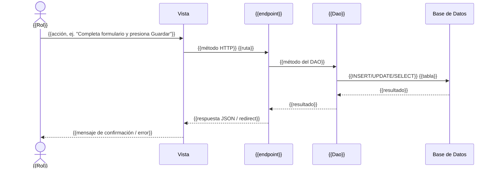

# Diagrama de Secuencia: {{Nombre del CU}} — {{Alta|Baja|Modificar}}

> Este archivo es la fuente de texto para redibujar el diagrama en tu herramienta UML.
> No reemplaza el diagrama gráfico del documento final — es la referencia verificada contra código para que el diagrama que dibujes coincida con el flujo real.

## Participantes
- Actor: {{Rol}}
- Vista: `{{archivo html/plantilla}}`
- Controlador/Ruta: `{{archivo *_api.py, método HTTP + endpoint}}`
- DAO: `{{Clase Dao, método}}`
- Base de Datos: `{{tabla(s) afectada(s)}}`

## Secuencia (texto)

## Validaciones representadas en el diagrama
- {{ej. "verificación de unicidad antes del INSERT"}}
- {{ej. "verificación de conflicto de horario antes de crear la cita"}}
